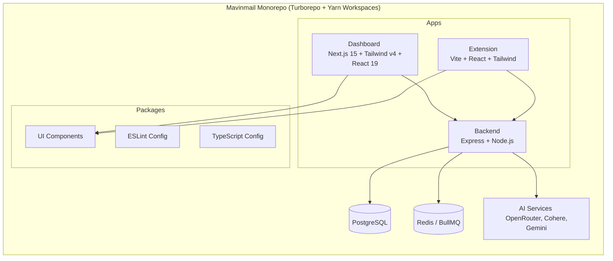

# 📧 Mavinmail

Mavinmail is a powerful, AI-driven email assistant built as a modern monorepo. It features a complete ecosystem comprising a powerful Node.js/Express backend, a sleek Next.js dashboard, and a React-based browser extension, all harmonized using Turborepo.

---

## 🏗 Project Architecture  




## 🚀 Tech Stack

### Backend (`apps/backend`)
- **Runtime & Framework:** Node.js, Express, TypeScript, tsx
- **Database & ORM:** PostgreSQL, Prisma
- **Queueing & Caching:** Redis, BullMQ
- **Authentication:** Passport.js (Google OAuth 2.0), JWT
- **AI Integration:** Google Generative AI, Cohere, Pinecone, OpenRouter
- **Documentation:** Swagger/OpenAPI

### Dashboard (`apps/dashboard`)
- **Framework:** Next.js 15 (Static export), React 19
- **Styling:** Tailwind CSS v4, Framer Motion
- **UI Components:** Radix UI primitives
- **Forms & Validation:** React Hook Form, Zod, Axios

### Extension (`apps/extension`)
- **Build Tool:** Vite
- **Framework:** React 19
- **State Management:** Zustand
- **Styling:** Tailwind CSS v4, Framer Motion

## 🛠 Prerequisites

Before you start, make sure you have the following installed:
- **Node.js** (v18 or higher)
- **Yarn** (v1.22+)
- **Docker & Docker Compose** (for running the PostgreSQL database)

You will also need API keys for:
- Google OAuth (Client ID and Secret)
- OpenRouter, Cohere, and Pinecone (if you intend to utilize the AI features)

## ⚙️ Setup & Installation

**1. Clone the repository**
```bash
git clone <repository-url>
cd Mavinmail
```

**2. Install dependencies**
Install dependencies for all workspaces using Yarn:
```bash
yarn install
```

**3. Configure Environment Variables**
Navigate to `apps/backend` and duplicate the `.env.example` file to create your local `.env` configuration:
```bash
cd apps/backend
cp .env.example .env
```
Open `apps/backend/.env` and fill in your API keys, OAuth credentials, and database URL.

**4. Start the Database (Docker)**
Mavinmail requires a PostgreSQL database. You can start one easily using the provided Docker configuration in the backend:
```bash
cd apps/backend
docker-compose up -d
```
*(This starts a Postgres container exposed on port `5432` with the default user/password `mavinmail` matching the `.env.example` DATABASE_URL).*

**5. Database Migrations & Client Generation**
Once the database is running, apply the Prisma schema:
```bash
cd apps/backend
npx prisma db push
```

## 🏃‍♂️ How to Run

### Run the entire project (Recommended)
You can run the backend, dashboard, and extension concurrently from the root directory using Turborepo:

```bash
# from the root of the project
yarn dev
```
*(This executes `turbo run dev`, starting all development servers simultaneously).*

### Run individual applications
If you prefer to run applications individually:

- **Backend**:
  ```bash
  cd apps/backend
  yarn dev
  ```
  *(Runs on [http://localhost:5001](http://localhost:5001))*

- **Dashboard**:
  ```bash
  cd apps/dashboard
  yarn dev
  ```
  *(Runs on [http://localhost:3000](http://localhost:3000))*

- **Extension**:
  ```bash
  cd apps/extension
  yarn dev
  ```

## 📂 Project Structure Overview

```text
Mavinmail/
├── apps/
│   ├── backend/        # Express API server, db models, queues, AI logic
│   ├── dashboard/      # Next.js web application for managing emails/settings
│   └── extension/      # Browser extension source code
├── packages/
│   ├── ui/             # Shared React UI components
│   ├── eslint-config/  # Shared linting rules
│   └── typescript-config/# Shared TS compilations settings
├── turbo.json          # Turborepo task pipeline configuration
└── package.json        # Root workspace configuration
```
